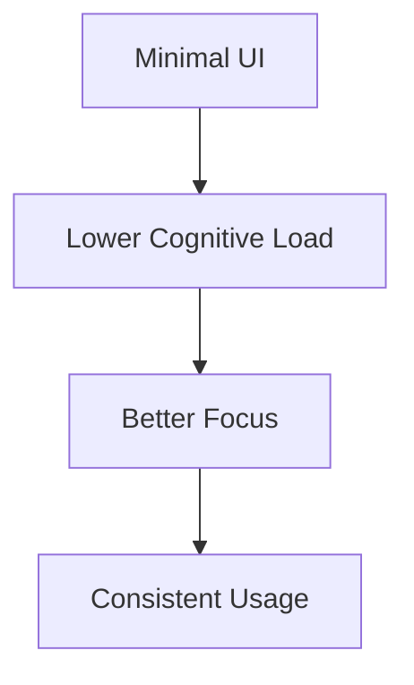

<p align="center">
  
</p>

<h1 align="center">🍃 PlayForCalm</h1>

<p align="center">
  <i>A Zen-oriented interactive web experience for focus & mental clarity</i>
</p>

<p align="center">
  
  
  
  
  
</p>

---

## 🧠 About

**PlayForCalm** is an interactive web application built to support  
**focus, clarity, and mental balance** through calm, intentional digital experiences.

Instead of dopamine-driven loops, this project emphasizes:

- 🧘 Mindful interaction  
- 🧠 Cognitive clarity  
- 🔁 Consistency over competition  

Classic puzzles like **Sudoku** and **Memory Games** are reframed as  
**focus-training tools** — not sources of stress or pressure.

---

## ✨ Features

| Feature | Description |
|------|------------|
| 🌍 **Multi-language (i18n)** | Instant language switching without reload |
| 🧘 **Zen UI/UX** | Low-contrast colors & calm motion |
| 📱 **Responsive Layout** | Adaptive navigation for desktop & mobile |
| 🔥 **Gentle Gamification** | Focus streaks & leveling (no pressure loops) |
| ⚡ **Performance-first** | Minimal CLS & fast rendering |

---

## 🛠️ Tech Stack

```ts
const stack = {
  framework: "Next.js 15 (App Router)",
  styling: "Tailwind CSS",
  animation: "Framer Motion",
  state: "React Context API",
  i18n: "Custom JSON Dictionary",
  icons: "Lucide React",
  build: "Turbopack",
};
````

---

## 📦 Project Structure

```txt
playforcalm
 ┣ 📂 app
 ┃ ┣ 📜 layout.tsx        # Root layout & global providers
 ┃ ┣ 📜 icon.tsx          # Dynamic favicon (Edge Runtime)
 ┃ ┗ 📜 page.tsx          # Main entry point
 ┣ 📂 components
 ┃ ┣ 📂 layout            # Navbar, Footer
 ┃ ┗ 📂 ui                # Buttons, cards, overlays
 ┣ 📂 context             # Language & gamification state
 ┣ 📂 dictionaries        # i18n JSON files
 ┗ 📂 public              # Static assets
```

---

## 🎞️ UX Philosophy

<sub>Why it feels calm — not empty</sub>



* 🎨 Color palette avoids harsh contrast
* 🎞️ Animations are **state-driven**, not decorative
* ⏱️ Transitions guide attention — never distract it

---

## 🧪 Development Workflow

```txt
feat/*      → new features
fix/*       → bug fixes
refactor/*  → structural improvements
```

* ✅ Pull request–based workflow
* 🔄 CI pipeline for build validation
* 🧹 Consistent linting & formatting

---

<p align="center">
  <sub>Built to feel quiet. Designed to stay.</sub>
</p>
```

--
